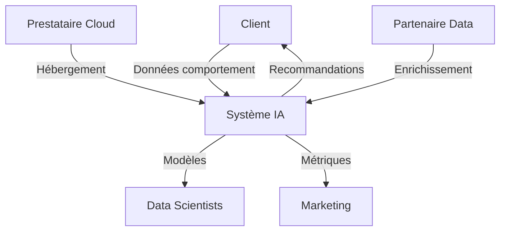

# Chapitre 4 : Data & Gouvernance

*Temps de lecture estimé : 45 minutes*

## Introduction : La Donnée comme Actif Stratégique

L'intelligence artificielle n'est que le reflet de la qualité de ses données. Sans gouvernance robuste, même les modèles les plus sophistiqués produiront des résultats médiocres, biaisés ou non conformes. Ce chapitre vous donne les clés pour construire une architecture de données fiable, sécurisée et conforme aux réglementations européennes.

Dans ce chapitre, nous couvrons :
- **Architecture de données** pour l'IA moderne
- **Conformité RGPD** et protection des données personnelles
- **Qualité des données** et processus de validation
- **Privacy-preserving AI** et techniques avancées
- **Audit et traçabilité** des modèles IA

## 🏗️ Architecture de Données pour l'IA

### Le Data Stack Moderne

```
┌─────────────────┐    ┌─────────────────┐    ┌─────────────────┐
│   DATA SOURCES  │    │  DATA PLATFORM  │    │  AI/ML LAYER    │
├─────────────────┤    ├─────────────────┤    ├─────────────────┤
│ • Transactional │────│ • Data Lake     │────│ • Feature Store │
│ • Streaming     │    │ • Data Warehouse│    │ • Model Registry│
│ • External APIs │    │ • Data Catalog  │    │ • ML Pipelines  │
│ • Documents     │    │ • Governance    │    │ • Inference API │
└─────────────────┘    └─────────────────┘    └─────────────────┘
                              │
                    ┌─────────────────┐
                    │   GOVERNANCE    │
                    ├─────────────────┤
                    │ • Data Quality  │
                    │ • Privacy       │
                    │ • Lineage       │
                    │ • Access Control│
                    └─────────────────┘
```

### Stratégie Data Lake vs Data Warehouse

**Comparaison architecturale :**

| Aspect | Data Lake | Data Warehouse | Lakehouse (Hybride) |
|--------|-----------|----------------|-------------------|
| **Structure** | Schema-on-read | Schema-on-write | Schema evolution |
| **Formats** | Tous formats | Structuré uniquement | Multi-format |
| **Coût stockage** | Très bas | Élevé | Modéré |
| **Time-to-insight** | Variable | Rapide | Rapide |
| **Governance** | Complexe | Native | Intégrée |
| **ML/AI** | Excellent | Limité | Optimal |

**Recommandation architecture moderne :**
```yaml
# Modern Data Architecture for AI
data_platform:
  storage_layer:
    raw_data: 
      technology: "AWS S3 / Azure Data Lake"
      formats: ["parquet", "delta", "json", "csv"]
      retention: "7 years"
      
    processed_data:
      technology: "Delta Lake / Apache Iceberg"  
      features: ["ACID transactions", "time travel", "schema evolution"]
      
    vector_storage:
      technology: "Pinecone / Weaviate / ChromaDB"
      use_case: "Embeddings for RAG applications"
      
  processing_layer:
    batch_processing:
      technology: "Apache Spark / Databricks"
      schedule: "Daily ETL + Weekly ML retraining"
      
    stream_processing:
      technology: "Apache Kafka / Kinesis"
      use_case: "Real-time feature computation"
      
  governance_layer:
    data_catalog: "Apache Atlas / AWS Glue Data Catalog"
    lineage_tracking: "DataHub / Apache Atlas"
    quality_monitoring: "Great Expectations / Deequ"
    access_control: "Apache Ranger / Unity Catalog"
```

### Bases de Données Vectorielles

**Choix de solution selon le cas d'usage :**

```python
# Guide de sélection base vectorielle
def select_vector_db(requirements):
    """
    Sélectionne la base vectorielle optimale selon les critères
    """
    solutions = {
        "pinecone": {
            "best_for": "Production scale, managed service",
            "pros": ["Performance", "Scalabilité", "Managed"],
            "cons": ["Coût", "Vendor lock-in"],
            "max_vectors": "Unlimited",
            "latency": "<50ms",
            "cost": "High"
        },
        "weaviate": {
            "best_for": "Multi-modal AI, semantic search",
            "pros": ["Open source", "Multi-modal", "GraphQL"],
            "cons": ["Complexité setup", "Moins mature"],
            "max_vectors": "Billions", 
            "latency": "<100ms",
            "cost": "Medium"
        },
        "chromadb": {
            "best_for": "Prototyping, small scale",
            "pros": ["Simple", "Gratuit", "Local"],
            "cons": ["Performance limitée", "Pas pour prod"],
            "max_vectors": "Millions",
            "latency": "Variable",
            "cost": "Free"
        },
        "elasticsearch": {
            "best_for": "Search existant, budget contraint",
            "pros": ["Écosystème mature", "Multi-usage"],
            "cons": ["Pas optimisé IA", "Complexité"],
            "max_vectors": "Billions",
            "latency": "100-200ms", 
            "cost": "Low-Medium"
        }
    }
    
    # Logique de sélection
    if requirements["scale"] == "enterprise" and requirements["budget"] == "high":
        return solutions["pinecone"]
    elif requirements["multi_modal"] == True:
        return solutions["weaviate"]
    elif requirements["stage"] == "prototype":
        return solutions["chromadb"]
    else:
        return solutions["elasticsearch"]

# Exemple d'usage
requirements = {
    "scale": "enterprise",
    "budget": "high", 
    "latency_requirement": 50,  # ms
    "vector_count": 100_000_000,
    "multi_modal": False
}

recommended_db = select_vector_db(requirements)
```

**Architecture RAG optimisée :**
```yaml
# Production RAG Architecture
rag_system:
  data_ingestion:
    documents: 
      - "PDF extraction with OCR fallback"
      - "Structured data (JSON, CSV, DB)"
      - "Real-time API feeds"
      
    preprocessing:
      - "Document chunking (semantic-aware)"
      - "Metadata extraction"
      - "Quality filtering"
      
  vector_pipeline:
    embedding_model: "text-embedding-ada-002"
    chunk_size: 1000
    chunk_overlap: 200
    
    indexing_strategy:
      hierarchical: "Document → Section → Paragraph"
      metadata_filters: ["department", "date", "category"]
      
  retrieval_system:
    primary_search: "Vector similarity (top-k=20)"
    reranking: "Cross-encoder model (top-3)"
    hybrid_search: "Vector + keyword (BM25)"
    
  governance:
    access_control: "Document-level permissions"
    audit_logging: "All queries logged with user context"
    privacy_filtering: "PII detection and masking"
```

## 📋 Conformité RGPD et Protection des Données

### Framework de Conformité RGPD

**Les 7 Principes Fondamentaux :**

1. **Licéité, loyauté et transparence**
2. **Limitation des finalités** 
3. **Minimisation des données**
4. **Exactitude**
5. **Limitation de la conservation**
6. **Intégrité et confidentialité**
7. **Responsabilité**

### Analyse d'Impact RGPD (AIPD) pour l'IA

**Template AIPD spécialisé IA :**

```markdown
# ANALYSE D'IMPACT PROTECTION DES DONNÉES - Projet IA

## 1. DESCRIPTION DU PROJET
**Nom du projet :** [Système IA de recommandation produits]
**Finalité :** [Personnaliser l'expérience client et augmenter les ventes]
**Base légale :** [Intérêt légitime / Consentement / Exécution contrat]

## 2. DONNÉES TRAITÉES

### Catégories de données personnelles :
- [ ] Données d'identification (nom, email, ID client)
- [ ] Données comportementales (clics, achats, navigation)
- [ ] Données techniques (IP, cookies, device fingerprint)
- [ ] Données dérivées (scores, segments, prédictions)

### Données sensibles (Art. 9 RGPD) :
- [ ] Origine raciale/ethnique
- [ ] Opinions politiques
- [ ] Convictions religieuses
- [ ] Données de santé
- [ ] Données biométriques

## 3. ACTEURS ET FLUX


## 4. RISQUES IDENTIFIÉS

| Risque | Impact | Probabilité | Niveau | Mesures d'atténuation |
|--------|--------|-------------|--------|----------------------|
| **Biais algorithmique** | Élevé | Moyenne | 🔴 Élevé | Audit régulier, datasets diversifiés |
| **Re-identification** | Très élevé | Faible | 🟠 Moyen | Anonymisation k-anonymity |
| **Profilage abusif** | Moyen | Élevée | 🟠 Moyen | Limitation finalités, droit opposition |
| **Fuite de données** | Très élevé | Faible | 🟠 Moyen | Chiffrement, access control |

## 5. MESURES DE PROTECTION

### Privacy by Design :
- [ ] Minimisation données (collecte strict nécessaire)
- [ ] Pseudonymisation des identifiants
- [ ] Chiffrement end-to-end
- [ ] Audit trails complets
- [ ] Tests d'adversarial attacks

### Droits des personnes concernées :
- [ ] Information transparente (notice IA)
- [ ] Droit d'accès (export données + explications)  
- [ ] Droit de rectification
- [ ] Droit d'opposition au profilage
- [ ] Droit à l'explication des décisions automatisées
```

### Implémentation Technique RGPD

**Pseudonymisation avancée :**
```python
import hashlib
import hmac
from cryptography.fernet import Fernet

class GDPRCompliantPseudonymizer:
    def __init__(self, master_key: str):
        self.master_key = master_key.encode()
        self.fernet = Fernet(Fernet.generate_key())
        
    def pseudonymize_user_id(self, user_id: str, purpose: str) -> str:
        """
        Pseudonymisation contextuelle selon la finalité
        Permet la re-identification si nécessaire tout en protégeant
        """
        # Salt unique par finalité
        purpose_salt = hmac.new(
            self.master_key, 
            purpose.encode(), 
            hashlib.sha256
        ).digest()
        
        # Hash avec salt contextuel  
        pseudo_id = hmac.new(
            purpose_salt,
            user_id.encode(),
            hashlib.sha256
        ).hexdigest()
        
        return f"pseudo_{purpose}_{pseudo_id[:16]}"
    
    def anonymize_for_ml(self, dataframe, quasi_identifiers):
        """
        K-anonymité pour jeux de données ML
        """
        # Implémentation k-anonymity avec suppression/généralisation
        k = 5  # Minimum 5 individus par groupe
        
        for column in quasi_identifiers:
            # Généralisation hiérarchique
            if dataframe[column].dtype == 'datetime64[ns]':
                # Date → Année-Mois
                dataframe[column] = dataframe[column].dt.to_period('M')
            elif dataframe[column].dtype == 'int64':
                # Age → Tranches d'âge  
                dataframe[column] = pd.cut(dataframe[column], bins=5)
                
        # Vérification k-anonymity
        group_sizes = dataframe.groupby(quasi_identifiers).size()
        if (group_sizes < k).any():
            # Suppression records problématiques
            valid_groups = group_sizes[group_sizes >= k].index
            dataframe = dataframe.set_index(quasi_identifiers).loc[valid_groups].reset_index()
            
        return dataframe

# Usage
pseudonymizer = GDPRCompliantPseudonymizer("your-master-key")
training_user_id = pseudonymizer.pseudonymize_user_id("user123", "ml_training")
analytics_user_id = pseudonymizer.pseudonymize_user_id("user123", "analytics")
```

**Gestion du Consentement :**
```javascript
// Consent Management for AI Systems
class AIConsentManager {
    constructor() {
        this.purposes = {
            'personalization': {
                name: 'Personalisation des recommandations',
                description: 'Utilise vos données d\'achat pour des suggestions personnalisées',
                legal_basis: 'consent',
                data_categories: ['purchase_history', 'browsing_behavior'],
                retention_period: '24 months',
                automated_decision: true
            },
            'fraud_detection': {
                name: 'Détection de fraude',
                description: 'Analyse automatique pour protéger votre compte',
                legal_basis: 'legitimate_interest',
                data_categories: ['transaction_data', 'device_info'],
                retention_period: '36 months',
                automated_decision: true
            }
        };
    }
    
    async getConsentStatus(userId, purpose) {
        const consent = await this.db.getConsent(userId, purpose);
        return {
            granted: consent.status === 'granted',
            timestamp: consent.timestamp,
            expiry: this.calculateExpiry(consent.timestamp),
            withdrawal_method: '/privacy/withdraw-consent'
        };
    }
    
    async recordConsentChange(userId, purpose, granted, source = 'user_action') {
        const record = {
            user_id: userId,
            purpose: purpose,
            status: granted ? 'granted' : 'withdrawn',
            timestamp: new Date(),
            source: source,
            ip_address: this.hashIP(request.ip),
            user_agent_hash: this.hashUserAgent(request.userAgent)
        };
        
        await this.db.recordConsent(record);
        
        // Propagation aux systèmes ML
        if (!granted) {
            await this.mlSystem.removeUserData(userId, purpose);
            await this.vectorDB.deleteUserVectors(userId, purpose);
        }
    }
}
```

## 🔍 Qualité des Données et Validation

### Framework de Data Quality

**Les 6 Dimensions de la Qualité :**

1. **Complétude** - Absence de valeurs manquantes critiques
2. **Exactitude** - Conformité avec la réalité  
3. **Cohérence** - Uniformité à travers les systèmes
4. **Validité** - Respect des formats et contraintes
5. **Actualité** - Fraîcheur et mise à jour
6. **Unicité** - Absence de doublons

### Implémentation Great Expectations

```python
import great_expectations as ge
from great_expectations.dataset import Dataset

class AIDataValidator:
    def __init__(self, data_context_path: str):
        self.context = ge.get_context(context_root_dir=data_context_path)
        
    def create_ml_dataset_expectations(self, dataset_name: str):
        """
        Crée les attentes de qualité pour un dataset ML
        """
        suite_name = f"{dataset_name}_ml_suite"
        suite = self.context.create_expectation_suite(suite_name)
        
        # Expectations communes pour ML
        expectations = [
            # Complétude
            {
                "expectation_type": "expect_column_values_to_not_be_null",
                "kwargs": {"column": "target_variable"}
            },
            
            # Distribution des classes (pas de class imbalance extrême)
            {
                "expectation_type": "expect_column_proportion_of_unique_values_to_be_between", 
                "kwargs": {
                    "column": "target_variable",
                    "min_value": 0.01,  # Au moins 1% par classe
                    "max_value": 0.99   # Pas plus de 99% d'une classe
                }
            },
            
            # Pas de dérive statistique
            {
                "expectation_type": "expect_column_mean_to_be_between",
                "kwargs": {
                    "column": "feature_numeric", 
                    "min_value": -3,  # 3 écarts-types de la baseline
                    "max_value": 3
                }
            },
            
            # Détection d'outliers
            {
                "expectation_type": "expect_column_quantile_values_to_be_between",
                "kwargs": {
                    "column": "feature_numeric",
                    "quantile_ranges": {
                        "quantiles": [0.01, 0.99],
                        "value_ranges": [[-100, 100], [-100, 100]]
                    }
                }
            }
        ]
        
        for expectation in expectations:
            suite.add_expectation(**expectation)
            
        return suite
        
    def validate_training_data(self, df, suite_name: str):
        """
        Valide un dataset d'entraînement avant utilisation
        """
        batch = ge.dataset.PandasDataset(df)
        
        results = batch.validate(
            expectation_suite_name=suite_name,
            result_format="SUMMARY"
        )
        
        if not results["success"]:
            failed_expectations = [
                exp for exp in results["results"] 
                if not exp["success"]
            ]
            
            raise DataQualityError(
                f"Data validation failed: {len(failed_expectations)} issues",
                details=failed_expectations
            )
            
        return results

# Configuration monitoring continu
data_quality_config = {
    "monitoring_schedule": "daily",
    "alert_thresholds": {
        "completeness": 0.95,      # 95% complétude minimum
        "accuracy": 0.90,          # 90% exactitude minimum  
        "freshness_hours": 24,     # Données < 24h
        "schema_changes": 0        # Aucun changement schema non approuvé
    },
    "notifications": {
        "slack_channel": "#data-quality-alerts",
        "email_list": ["data-team@company.com"],
        "severity_levels": ["WARNING", "ERROR", "CRITICAL"]
    }
}
```

### Data Lineage et Traçabilité

**Implémentation avec Apache Atlas :**
```python
from pyatlas import Atlas
import json

class AIDataLineageTracker:
    def __init__(self, atlas_endpoint: str):
        self.atlas = Atlas(atlas_endpoint)
        
    def track_ml_pipeline(self, pipeline_run):
        """
        Enregistre la lignée complète d'un pipeline ML
        """
        entities = []
        
        # Dataset source
        source_entity = {
            "typeName": "DataSet",
            "attributes": {
                "name": pipeline_run["source_dataset"],
                "qualifiedName": f"{pipeline_run['source_dataset']}@{pipeline_run['environment']}",
                "description": "Source dataset for ML training",
                "uri": pipeline_run["source_uri"]
            }
        }
        entities.append(source_entity)
        
        # Feature engineering process  
        fe_process = {
            "typeName": "Process",
            "attributes": {
                "name": f"feature_engineering_{pipeline_run['pipeline_id']}",
                "qualifiedName": f"fe_process_{pipeline_run['pipeline_id']}@{pipeline_run['environment']}",
                "inputs": [source_entity["attributes"]["qualifiedName"]],
                "outputs": [f"features_{pipeline_run['pipeline_id']}@{pipeline_run['environment']}"]
            }
        }
        entities.append(fe_process)
        
        # Modèle ML
        model_entity = {
            "typeName": "MLModel", 
            "attributes": {
                "name": f"model_{pipeline_run['model_name']}",
                "qualifiedName": f"model_{pipeline_run['model_name']}_v{pipeline_run['version']}@{pipeline_run['environment']}",
                "algorithm": pipeline_run["algorithm"],
                "hyperparameters": json.dumps(pipeline_run["hyperparameters"]),
                "performance_metrics": json.dumps(pipeline_run["metrics"]),
                "training_dataset": f"features_{pipeline_run['pipeline_id']}@{pipeline_run['environment']}"
            }
        }
        entities.append(model_entity)
        
        # Enregistrement dans Atlas
        response = self.atlas.entity.create_entities(entities)
        return response
        
    def query_model_lineage(self, model_name: str):
        """
        Récupère la lignée complète d'un modèle
        """
        lineage = self.atlas.lineage.get_lineage(
            guid=self.get_model_guid(model_name),
            direction="BOTH",
            depth=10
        )
        
        return {
            "upstream_datasets": self.extract_upstream_datasets(lineage),
            "downstream_applications": self.extract_downstream_apps(lineage),
            "transformation_steps": self.extract_transformations(lineage)
        }
```

## 🔐 Privacy-Preserving AI

### Techniques d'Anonymisation Avancées

**Differential Privacy pour ML :**
```python
import numpy as np
from diffprivlib.models import GaussianNB
from diffprivlib.mechanisms import Laplace

class DifferentiallyPrivateML:
    def __init__(self, epsilon: float = 1.0):
        """
        epsilon: paramètre de confidentialité
        Plus petit = plus privé mais moins précis
        """
        self.epsilon = epsilon
        self.laplace = Laplace(epsilon=epsilon, delta=0.0)
        
    def train_private_model(self, X, y):
        """
        Entraîne un modèle avec differential privacy
        """
        # Modèle avec DP intégré
        model = GaussianNB(
            epsilon=self.epsilon,
            bounds=self._compute_bounds(X)
        )
        
        model.fit(X, y)
        return model
        
    def add_noise_to_gradients(self, gradients, sensitivity):
        """
        Ajoute du bruit aux gradients pour DP-SGD
        """
        noisy_gradients = []
        for gradient in gradients:
            # Clipping pour borner la sensibilité
            clipped_gradient = np.clip(gradient, -sensitivity, sensitivity)
            
            # Ajout de bruit Gaussien
            noise = np.random.normal(0, sensitivity * np.sqrt(2 * np.log(1.25)) / self.epsilon, clipped_gradient.shape)
            noisy_gradient = clipped_gradient + noise
            
            noisy_gradients.append(noisy_gradient)
        
        return noisy_gradients
    
    def private_data_release(self, data, query_func):
        """
        Publication de statistiques avec garanties DP
        """
        true_result = query_func(data)
        noisy_result = self.laplace.randomise(true_result)
        
        return noisy_result

# Federated Learning Setup
class FederatedLearningCoordinator:
    def __init__(self, num_clients: int, privacy_budget: float):
        self.clients = num_clients
        self.epsilon = privacy_budget
        
    def coordinate_training(self, global_model, client_data_loaders):
        """
        Coordination d'entraînement fédéré avec privacy
        """
        for round in range(self.num_rounds):
            client_updates = []
            
            for client_id, data_loader in enumerate(client_data_loaders):
                # Entraînement local avec DP
                local_model = self.train_local_model(
                    global_model, 
                    data_loader,
                    epsilon=self.epsilon/self.num_rounds  # Composition DP
                )
                
                # Seulement les gradients sont partagés
                client_updates.append(local_model.get_gradients())
            
            # Agrégation sécurisée
            global_model = self.aggregate_updates(global_model, client_updates)
            
        return global_model
```

### Homomorphic Encryption pour IA

```python
from phe import paillier
import numpy as np

class HomomorphicMLInference:
    def __init__(self):
        self.public_key, self.private_key = paillier.generate_paillier_keypair()
        
    def encrypt_dataset(self, X):
        """
        Chiffre un dataset pour inférence sécurisée
        """
        encrypted_X = []
        for row in X:
            encrypted_row = [self.public_key.encrypt(float(x)) for x in row]
            encrypted_X.append(encrypted_row)
        return encrypted_X
    
    def secure_linear_prediction(self, encrypted_features, model_weights):
        """
        Prédiction linéaire sur données chiffrées
        """
        encrypted_predictions = []
        
        for encrypted_row in encrypted_features:
            # Calcul du produit scalaire chiffré
            encrypted_sum = self.public_key.encrypt(0)
            
            for i, (encrypted_feature, weight) in enumerate(zip(encrypted_row, model_weights)):
                # Multiplication homomorphe (feature chiffrée × weight en clair)
                encrypted_product = encrypted_feature * weight
                encrypted_sum += encrypted_product
                
            encrypted_predictions.append(encrypted_sum)
            
        return encrypted_predictions
    
    def decrypt_results(self, encrypted_predictions):
        """
        Déchiffre les résultats côté possesseur de la clé privée
        """
        return [self.private_key.decrypt(pred) for pred in encrypted_predictions]

# Usage pour inférence confidentielle
he_system = HomomorphicMLInference()

# Côté client : chiffrement des données
client_data = np.array([[1.2, 3.4, 5.6], [2.1, 4.3, 6.5]])
encrypted_data = he_system.encrypt_dataset(client_data)

# Côté serveur : inférence sur données chiffrées
model_weights = [0.5, -0.3, 0.8]
encrypted_results = he_system.secure_linear_prediction(encrypted_data, model_weights)

# Côté client : déchiffrement des résultats
predictions = he_system.decrypt_results(encrypted_results)
```

## 📊 Audit et Traçabilité des Modèles

### Model Registry et Versioning

```python
import mlflow
import hashlib
import json
from datetime import datetime

class AIModelGovernance:
    def __init__(self, mlflow_tracking_uri: str):
        mlflow.set_tracking_uri(mlflow_tracking_uri)
        self.client = mlflow.tracking.MlflowClient()
        
    def register_model_with_governance(self, model, model_name: str, 
                                     training_data_signature: str,
                                     governance_metadata: dict):
        """
        Enregistre un modèle avec métadonnées de gouvernance complètes
        """
        with mlflow.start_run() as run:
            # Enregistrement modèle standard
            mlflow.sklearn.log_model(model, "model")
            
            # Métadonnées de gouvernance
            governance_tags = {
                "data_source": governance_metadata["data_source"],
                "training_date": datetime.now().isoformat(),
                "data_signature": training_data_signature,
                "gdpr_compliant": governance_metadata.get("gdpr_compliant", False),
                "bias_tested": governance_metadata.get("bias_tested", False),
                "performance_baseline": json.dumps(governance_metadata["metrics"]),
                "approved_for_production": False,  # Require explicit approval
                "data_retention_policy": governance_metadata.get("retention_policy", "2_years")
            }
            
            mlflow.set_tags(governance_tags)
            
            # Hash du code d'entraînement pour reproductibilité
            training_code_hash = self.hash_training_code(governance_metadata["training_script"])
            mlflow.log_param("training_code_hash", training_code_hash)
            
            # Enregistrement dans le registry
            model_version = mlflow.register_model(
                model_uri=f"runs:/{run.info.run_id}/model",
                name=model_name
            )
            
            return model_version
    
    def approve_model_for_production(self, model_name: str, version: int, 
                                   approver: str, approval_criteria: dict):
        """
        Processus d'approbation formelle pour déploiement
        """
        # Vérification critères d'approbation
        model_version = self.client.get_model_version(model_name, version)
        
        checks_passed = self.validate_approval_criteria(model_version, approval_criteria)
        
        if checks_passed:
            # Transition vers Production
            self.client.transition_model_version_stage(
                name=model_name,
                version=version,
                stage="Production"
            )
            
            # Log d'audit
            self.client.set_model_version_tag(
                name=model_name,
                version=version,
                key="production_approval",
                value=json.dumps({
                    "approver": approver,
                    "approval_date": datetime.now().isoformat(),
                    "criteria_met": approval_criteria,
                    "approval_id": self.generate_approval_id()
                })
            )
        else:
            raise ModelApprovalError("Model doesn't meet production criteria")
    
    def generate_model_audit_report(self, model_name: str, version: int):
        """
        Génère un rapport d'audit complet pour un modèle
        """
        model_version = self.client.get_model_version(model_name, version)
        run = self.client.get_run(model_version.run_id)
        
        audit_report = {
            "model_info": {
                "name": model_name,
                "version": version,
                "status": model_version.current_stage,
                "creation_date": model_version.creation_timestamp
            },
            
            "data_governance": {
                "data_source": run.data.tags.get("data_source"),
                "data_signature": run.data.tags.get("data_signature"),  
                "gdpr_compliance": run.data.tags.get("gdpr_compliant") == "True",
                "retention_policy": run.data.tags.get("data_retention_policy")
            },
            
            "performance": {
                "metrics": json.loads(run.data.tags.get("performance_baseline", "{}")),
                "bias_analysis": self.get_bias_analysis(model_version),
                "drift_monitoring": self.get_drift_status(model_name, version)
            },
            
            "approval_history": self.get_approval_history(model_name, version),
            "usage_statistics": self.get_usage_stats(model_name, version),
            "security_scan": self.get_security_scan_results(model_name, version)
        }
        
        return audit_report

# Automatisation compliance checking
class ComplianceChecker:
    def __init__(self):
        self.rules = {
            "gdpr": {
                "required_tags": ["data_source", "gdpr_compliant", "retention_policy"],
                "data_minimization": True,
                "consent_tracking": True
            },
            "bias_detection": {
                "fairness_metrics": ["demographic_parity", "equalized_odds"],
                "protected_attributes": ["age", "gender", "ethnicity"],
                "threshold": 0.1  # Maximum bias allowed
            },
            "security": {
                "adversarial_robustness": True,
                "input_validation": True,
                "model_encryption": "at_rest"
            }
        }
    
    def check_model_compliance(self, model_metadata: dict):
        """
        Vérifie la conformité d'un modèle selon les règles définies
        """
        compliance_results = {}
        
        for regulation, requirements in self.rules.items():
            compliance_results[regulation] = self.check_regulation_compliance(
                model_metadata, requirements
            )
        
        overall_compliant = all(result["compliant"] for result in compliance_results.values())
        
        return {
            "overall_compliant": overall_compliant,
            "regulation_details": compliance_results,
            "recommendations": self.generate_compliance_recommendations(compliance_results)
        }
```

## ✅ Checklist de Gouvernance des Données

### Phase Setup (Semaine 1-2)
- [ ] **Architecture de données** définie (Lake/Warehouse/Lakehouse)
- [ ] **Catalogage automatique** des sources de données configuré
- [ ] **Politiques de rétention** définies par type de données
- [ ] **Access control** basé sur les rôles implémenté
- [ ] **Chiffrement** au repos et en transit activé

### Phase Compliance (Semaine 3-4)  
- [ ] **Analyse RGPD** complétée pour tous les cas d'usage IA
- [ ] **Consentement management** system déployé
- [ ] **Anonymisation/pseudonymisation** workflows implémentés
- [ ] **Droits des personnes** (accès, rectification, suppression) automatisés
- [ ] **Privacy notices** mises à jour avec détails IA

### Phase Qualité (Semaine 5-6)
- [ ] **Data quality rules** définies avec Great Expectations
- [ ] **Monitoring continu** de la dérive des données
- [ ] **Alerting automatique** sur les problèmes qualité
- [ ] **Lineage tracking** complet des pipelines ML
- [ ] **Validation gates** avant entraînement modèles

### Phase Audit (Semaine 7-8)
- [ ] **Model registry** avec métadonnées gouvernance
- [ ] **Processus d'approbation** modèles pour production
- [ ] **Audit trails** complets des décisions IA
- [ ] **Rapports de compliance** automatisés
- [ ] **Tests de sécurité** réguliers (adversarial attacks)

---

**La gouvernance des données n'est pas une contrainte mais un enabler de l'IA de confiance. Sans données de qualité et processes robustes, même les meilleurs algorithmes échouent.**

*Prochaine étape : [Chapitre 5 - Équipes & Compétences](05-equipe-competences.md)*